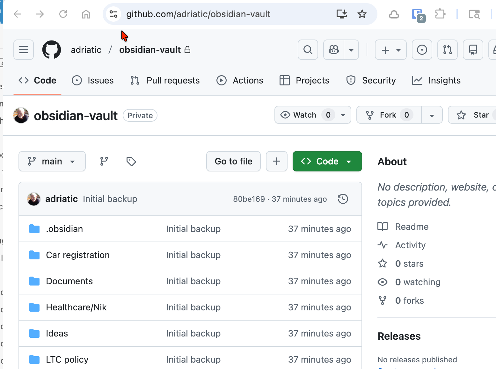

Briefly documenting the process of using a Github repository as Obsidian backup

The local copy of the vault is at main:Users:nik:Library:Mobile Documents:com~apple~CloudDocs:Obsidian:obsidianVault

The remote (Github) copy is at https://github.com/adriatic/obsidianVault. This repository is owned by adriatic:

